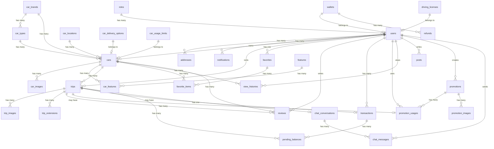

# 📦 Tài Liệu Cơ Sở Dữ Liệu - Website Thuê Xe

> **Database Engine:** MySQL (InnoDB)  
> **Framework:** Laravel 11  
> **Cập nhật lần cuối:** 29/07/2026

---

## 📑 Mục Lục

- [1. Tổng Quan](#1-tổng-quan)
- [2. Sơ Đồ Quan Hệ (ERD)](#2-sơ-đồ-quan-hệ-erd)
- [3. Chi Tiết Các Bảng](#3-chi-tiết-các-bảng)
  - [3.1. Quản Lý Người Dùng](#31-quản-lý-người-dùng)
  - [3.2. Quản Lý Xe](#32-quản-lý-xe)
  - [3.3. Quản Lý Chuyến Đi](#33-quản-lý-chuyến-đi)
  - [3.4. Quản Lý Khuyến Mãi](#34-quản-lý-khuyến-mãi)
  - [3.5. Quản Lý Tài Chính](#35-quản-lý-tài-chính)
  - [3.6. Tương Tác & Đánh Giá](#36-tương-tác--đánh-giá)
  - [3.7. Quản Lý Nội Dung](#37-quản-lý-nội-dung)
  - [3.8. Chat & AI](#38-chat--ai)
  - [3.9. Bảng Hệ Thống (Laravel)](#39-bảng-hệ-thống-laravel)
- [4. Giá Trị Enum & Trạng Thái](#4-giá-trị-enum--trạng-thái)

---

## 1. Tổng Quan

Hệ thống cơ sở dữ liệu gồm **35+ bảng**, được phân thành các nhóm chức năng:

| Nhóm | Số bảng | Mô tả |
|------|---------|-------|
| Quản lý Người dùng | 5 | Roles, Users, Wallets, Driving Licenses, Addresses |
| Quản lý Xe | 9 | Cars, Brands, Types, Locations, Images, Features, Delivery, Usage Limits |
| Quản lý Chuyến đi | 3 | Trips, Trip Images, Trip Extensions |
| Quản lý Khuyến mãi | 3 | Promotions, Promotion Images, Promotion Usages |
| Quản lý Tài chính | 4 | Transactions, Pending Balances, Wallets, Refunds |
| Tương tác & Đánh giá | 4 | Reviews, Favorites, Favorite Items, View Histories, Notifications |
| Quản lý Nội dung | 2 | Posts, Post Categories |
| Chat & AI | 4 | Chat Conversations, Chat Messages, Agent Conversations, Agent Messages |
| Hệ thống Laravel | 6 | Sessions, Cache, Jobs, Failed Jobs, Personal Access Tokens, Password Reset Tokens |

---

## 2. Sơ Đồ Quan Hệ (ERD)

---

## 3. Chi Tiết Các Bảng

### 3.1. Quản Lý Người Dùng

---

#### 🔹 `roles` — Vai trò người dùng

| Cột | Kiểu | Ràng buộc | Mô tả |
|-----|------|-----------|-------|
| `id` | BIGINT UNSIGNED | PK, AUTO_INCREMENT | Mã vai trò |
| `name` | VARCHAR(255) | UNIQUE, NOT NULL | Tên vai trò |
| `description` | TEXT | NULLABLE | Mô tả vai trò |
| `created_at` | TIMESTAMP | NULLABLE | Thời gian tạo |
| `updated_at` | TIMESTAMP | NULLABLE | Thời gian cập nhật |

---

#### 🔹 `wallets` — Ví điện tử

| Cột | Kiểu | Ràng buộc | Mô tả |
|-----|------|-----------|-------|
| `id` | BIGINT UNSIGNED | PK, AUTO_INCREMENT | Mã ví |
| `amount` | DECIMAL(10,0) | DEFAULT 0 | Số dư trong ví |
| `created_at` | TIMESTAMP | NULLABLE | Thời gian tạo |
| `updated_at` | TIMESTAMP | NULLABLE | Thời gian cập nhật |

---

#### 🔹 `driving_licenses` — Bằng lái xe

| Cột | Kiểu | Ràng buộc | Mô tả |
|-----|------|-----------|-------|
| `id` | BIGINT UNSIGNED | PK, AUTO_INCREMENT | Mã bằng lái |
| `full_name` | VARCHAR(255) | NOT NULL | Tên đầy đủ |
| `image` | TEXT | NOT NULL | Ảnh bằng lái xe |
| `driving_license_number` | VARCHAR(255) | UNIQUE, NOT NULL | Số bằng lái xe |
| `DOB` | DATE | NOT NULL | Ngày sinh |
| `status` | TINYINT | DEFAULT 0 | Trạng thái: `0` - chờ duyệt, `1` - đã duyệt, `2` - bị từ chối |
| `created_at` | TIMESTAMP | NULLABLE | Thời gian tạo |
| `updated_at` | TIMESTAMP | NULLABLE | Thời gian cập nhật |

> **Migration bổ sung:** `2026_06_20` — Thêm cột `status` sau cột `DOB`

---

#### 🔹 `users` — Người dùng

| Cột | Kiểu | Ràng buộc | Mô tả |
|-----|------|-----------|-------|
| `id` | BIGINT UNSIGNED | PK, AUTO_INCREMENT | Mã người dùng |
| `provider_id` | VARCHAR(255) | UNIQUE, NULLABLE | ID từ mạng xã hội (Facebook, Google) |
| `name` | TEXT | NOT NULL | Tên người dùng |
| `email` | VARCHAR(255) | UNIQUE, NULLABLE | Địa chỉ email |
| `email_verified_at` | TIMESTAMP | NULLABLE | Thời gian xác thực email |
| `password` | VARCHAR(255) | NOT NULL | Mật khẩu (hashed) |
| `phone` | VARCHAR(255) | NULLABLE | Số điện thoại |
| `avatar` | TEXT | NULLABLE | Ảnh đại diện |
| `gender` | TINYINT | NULLABLE | Giới tính: `0` - Nữ, `1` - Nam, `2` - Khác |
| `DOB` | DATE | NULLABLE | Ngày sinh |
| `national_number` | VARCHAR(255) | UNIQUE, NULLABLE | Số CCCD |
| `status` | TINYINT | DEFAULT 1 | Trạng thái: `0` - Bị khóa, `1` - Hoạt động |
| `role_id` | BIGINT UNSIGNED | FK → `roles.id` | Vai trò người dùng |
| `wallet_id` | BIGINT UNSIGNED | FK → `wallets.id`, NULLABLE | ID ví điện tử |
| `driving_license_id` | BIGINT UNSIGNED | FK → `driving_licenses.id`, NULLABLE, ON DELETE SET NULL | ID bằng lái xe |
| `bank_name` | VARCHAR(255) | NULLABLE | Tên ngân hàng |
| `bank_account_number` | VARCHAR(255) | NULLABLE | Số tài khoản ngân hàng |
| `remember_token` | VARCHAR(100) | NULLABLE | Token ghi nhớ đăng nhập |
| `created_at` | TIMESTAMP | NULLABLE | Thời gian tạo |
| `updated_at` | TIMESTAMP | NULLABLE | Thời gian cập nhật |

> **Migrations bổ sung:**
> - `2026_06_14` — Cột `phone` chuyển thành NULLABLE
> - `2026_06_19` — Thêm cột `provider_id` (Social Login)
> - `2026_07_15` — Thêm cột `bank_name` và `bank_account_number`

---

#### 🔹 `addresses` — Địa chỉ người dùng

| Cột | Kiểu | Ràng buộc | Mô tả |
|-----|------|-----------|-------|
| `id` | BIGINT UNSIGNED | PK, AUTO_INCREMENT | Mã địa chỉ |
| `address_name` | VARCHAR(255) | NOT NULL | Tên địa chỉ |
| `user_id` | BIGINT UNSIGNED | FK → `users.id`, ON DELETE CASCADE | Mã người dùng |
| `created_at` | TIMESTAMP | NULLABLE | Thời gian tạo |
| `updated_at` | TIMESTAMP | NULLABLE | Thời gian cập nhật |

---

#### 🔹 `notifications` — Thông báo

| Cột | Kiểu | Ràng buộc | Mô tả |
|-----|------|-----------|-------|
| `id` | BIGINT UNSIGNED | PK, AUTO_INCREMENT | Mã thông báo |
| `message` | TEXT | NOT NULL | Nội dung thông báo |
| `is_read` | ENUM('0','1') | DEFAULT '0' | Trạng thái đọc: `0` - Chưa đọc, `1` - Đã đọc |
| `user_id` | BIGINT UNSIGNED | FK → `users.id`, ON DELETE CASCADE | Mã người dùng nhận thông báo |
| `created_at` | TIMESTAMP | NULLABLE | Thời gian tạo |
| `updated_at` | TIMESTAMP | NULLABLE | Thời gian cập nhật |

---

### 3.2. Quản Lý Xe

---

#### 🔹 `car_locations` — Vị trí xe

| Cột | Kiểu | Ràng buộc | Mô tả |
|-----|------|-----------|-------|
| `id` | BIGINT UNSIGNED | PK, AUTO_INCREMENT | Mã vị trí |
| `location` | TEXT | NULLABLE | Tọa độ vị trí |
| `address` | TEXT | NULLABLE | Địa chỉ hiển thị |
| `created_at` | TIMESTAMP | NULLABLE | Thời gian tạo |
| `updated_at` | TIMESTAMP | NULLABLE | Thời gian cập nhật |

---

#### 🔹 `car_brands` — Thương hiệu xe

| Cột | Kiểu | Ràng buộc | Mô tả |
|-----|------|-----------|-------|
| `id` | BIGINT UNSIGNED | PK, AUTO_INCREMENT | Mã thương hiệu |
| `brand_name` | VARCHAR(255) | UNIQUE, NOT NULL | Tên thương hiệu |
| `created_at` | TIMESTAMP | NULLABLE | Thời gian tạo |
| `updated_at` | TIMESTAMP | NULLABLE | Thời gian cập nhật |

---

#### 🔹 `car_types` — Loại xe

| Cột | Kiểu | Ràng buộc | Mô tả |
|-----|------|-----------|-------|
| `id` | BIGINT UNSIGNED | PK, AUTO_INCREMENT | Mã loại xe |
| `type_name` | VARCHAR(255) | UNIQUE, NOT NULL | Tên loại xe |
| `car_brand_id` | BIGINT UNSIGNED | FK → `car_brands.id`, ON DELETE CASCADE | Mã thương hiệu |
| `created_at` | TIMESTAMP | NULLABLE | Thời gian tạo |
| `updated_at` | TIMESTAMP | NULLABLE | Thời gian cập nhật |

---

#### 🔹 `car_delivery_options` — Tùy chọn giao xe

| Cột | Kiểu | Ràng buộc | Mô tả |
|-----|------|-----------|-------|
| `id` | BIGINT UNSIGNED | PK, AUTO_INCREMENT | Mã tùy chọn |
| `max_distance` | FLOAT(10,2) | UNSIGNED | Khoảng cách tối đa giao xe (km) |
| `fee_distance` | FLOAT(10,2) | UNSIGNED | Phí mỗi km vượt khoảng cách tối đa |
| `free_distance` | FLOAT(10,2) | UNSIGNED | Khoảng cách miễn phí (km) |
| `status` | TINYINT | DEFAULT 0 | Trạng thái: `0` - Không áp dụng, `1` - Áp dụng |
| `created_at` | TIMESTAMP | NULLABLE | Thời gian tạo |
| `updated_at` | TIMESTAMP | NULLABLE | Thời gian cập nhật |

---

#### 🔹 `car_usage_limits` — Giới hạn sử dụng xe

| Cột | Kiểu | Ràng buộc | Mô tả |
|-----|------|-----------|-------|
| `id` | BIGINT UNSIGNED | PK, AUTO_INCREMENT | Mã giới hạn |
| `max_daily_distance` | FLOAT(10,2) | UNSIGNED | Khoảng cách tối đa mỗi ngày (km) |
| `extra_distance_fee` | DECIMAL(10,2) | UNSIGNED | Phí mỗi km vượt giới hạn |
| `status` | TINYINT | DEFAULT 0 | Trạng thái: `0` - Không áp dụng, `1` - Áp dụng |
| `created_at` | TIMESTAMP | NULLABLE | Thời gian tạo |
| `updated_at` | TIMESTAMP | NULLABLE | Thời gian cập nhật |

---

#### 🔹 `cars` — Xe cho thuê

| Cột | Kiểu | Ràng buộc | Mô tả |
|-----|------|-----------|-------|
| `id` | BIGINT UNSIGNED | PK, AUTO_INCREMENT | Mã xe |
| `name` | VARCHAR(255) | NOT NULL | Tên xe |
| `license_plate` | VARCHAR(12) | UNIQUE, NOT NULL | Biển số xe |
| `VIN` | VARCHAR(17) | UNIQUE, NOT NULL | Số khung (17 ký tự) |
| `engine_number` | VARCHAR(255) | UNIQUE, NOT NULL | Số máy |
| `fuel_consumption` | FLOAT(10,2) | UNSIGNED | Mức tiêu thụ nhiên liệu (L/100km) |
| `unit_price` | BIGINT | UNSIGNED | Đơn giá thuê xe (VNĐ/ngày) |
| `discount_value` | BIGINT | UNSIGNED, DEFAULT 0 | Giá trị giảm giá |
| `description` | TEXT | NULLABLE | Mô tả chi tiết |
| `rental_terms` | TEXT | NULLABLE | Điều khoản thuê xe |
| `car_location_id` | BIGINT UNSIGNED | FK → `car_locations.id`, ON DELETE CASCADE | Mã vị trí xe |
| `car_brand_id` | BIGINT UNSIGNED | FK → `car_brands.id`, ON DELETE CASCADE | Mã thương hiệu |
| `car_type_id` | BIGINT UNSIGNED | FK → `car_types.id`, ON DELETE CASCADE | Mã loại xe |
| `seat_count` | DECIMAL(2,0) | UNSIGNED | Số chỗ ngồi |
| `manufacture_year` | DATE | NOT NULL | Năm sản xuất |
| `fuel_type` | VARCHAR(255) | NOT NULL | Loại nhiên liệu |
| `transmission` | VARCHAR(255) | NOT NULL | Loại hộp số (Số sàn/Tự động) |
| `user_id` | BIGINT UNSIGNED | FK → `users.id`, ON DELETE CASCADE | Mã chủ xe |
| `delivery_option_id` | BIGINT UNSIGNED | FK → `car_delivery_options.id`, ON DELETE CASCADE | Mã tùy chọn giao xe |
| `usage_limit_id` | BIGINT UNSIGNED | FK → `car_usage_limits.id`, ON DELETE CASCADE | Mã giới hạn sử dụng |
| `status` | TINYINT | DEFAULT 2 | Trạng thái: `0` - Dừng HĐ, `1` - Đang HĐ, `2` - Chờ duyệt, `3` - Bị từ chối |
| `created_at` | TIMESTAMP | NULLABLE | Thời gian tạo |
| `updated_at` | TIMESTAMP | NULLABLE | Thời gian cập nhật |

---

#### 🔹 `car_images` — Hình ảnh xe

| Cột | Kiểu | Ràng buộc | Mô tả |
|-----|------|-----------|-------|
| `id` | BIGINT UNSIGNED | PK, AUTO_INCREMENT | Mã hình ảnh |
| `is_thumbnail` | TINYINT | DEFAULT 0 | `0` - Ảnh thường, `1` - Ảnh đại diện |
| `image_url` | TEXT | NOT NULL | Đường dẫn hình ảnh |
| `car_id` | BIGINT UNSIGNED | FK → `cars.id`, ON DELETE CASCADE | Mã xe |
| `created_at` | TIMESTAMP | NULLABLE | Thời gian tạo |
| `updated_at` | TIMESTAMP | NULLABLE | Thời gian cập nhật |

---

#### 🔹 `features` — Tính năng xe

| Cột | Kiểu | Ràng buộc | Mô tả |
|-----|------|-----------|-------|
| `id` | BIGINT UNSIGNED | PK, AUTO_INCREMENT | Mã tính năng |
| `feature_name` | VARCHAR(255) | UNIQUE, NOT NULL | Tên tính năng |
| `icon` | TEXT | NOT NULL | Biểu tượng (icon) |
| `description` | TEXT | NOT NULL | Mô tả tính năng |
| `status` | TINYINT | DEFAULT 1 | Trạng thái: `0` - Không HĐ, `1` - Hoạt động |
| `created_at` | TIMESTAMP | NULLABLE | Thời gian tạo |
| `updated_at` | TIMESTAMP | NULLABLE | Thời gian cập nhật |

---

#### 🔹 `car_features` — Tính năng của xe (Bảng trung gian)

| Cột | Kiểu | Ràng buộc | Mô tả |
|-----|------|-----------|-------|
| `id` | BIGINT UNSIGNED | PK, AUTO_INCREMENT | Mã bản ghi |
| `car_id` | BIGINT UNSIGNED | FK → `cars.id`, ON DELETE CASCADE | Mã xe |
| `feature_id` | BIGINT UNSIGNED | FK → `features.id`, ON DELETE CASCADE | Mã tính năng |
| `created_at` | TIMESTAMP | NULLABLE | Thời gian tạo |
| `updated_at` | TIMESTAMP | NULLABLE | Thời gian cập nhật |

---

### 3.3. Quản Lý Chuyến Đi

---

#### 🔹 `trips` — Chuyến đi (Đơn thuê xe)

| Cột | Kiểu | Ràng buộc | Mô tả |
|-----|------|-----------|-------|
| `id` | BIGINT UNSIGNED | PK, AUTO_INCREMENT | Mã chuyến đi |
| `cost` | DECIMAL(10,2) | UNSIGNED | Chi phí chuyến đi |
| `discount_amount` | DECIMAL(10,2) | UNSIGNED, DEFAULT 0 | Số tiền giảm giá |
| `status` | TINYINT | DEFAULT 0 | Trạng thái (xem bảng giá trị bên dưới) |
| `trip_type` | TINYINT | DEFAULT 0 | Loại: `0` - Thuê theo ngày, `1` - Thuê theo km |
| `start_at` | DATETIME | NOT NULL | Thời gian bắt đầu |
| `end_at` | DATETIME | NOT NULL | Thời gian kết thúc |
| `car_id` | BIGINT UNSIGNED | FK → `cars.id`, ON DELETE CASCADE | Mã xe |
| `user_id` | BIGINT UNSIGNED | FK → `users.id`, ON DELETE CASCADE | Mã người thuê |
| `delivery_address` | TEXT | NULLABLE | Địa chỉ giao xe |
| `delivery_location` | TEXT | NULLABLE | Tọa độ giao xe |
| `created_at` | TIMESTAMP | NULLABLE | Thời gian tạo |
| `updated_at` | TIMESTAMP | NULLABLE | Thời gian cập nhật |

**Trạng thái chuyến đi (`status`):**

| Giá trị | Ý nghĩa |
|---------|---------|
| `0` | Chờ duyệt |
| `1` | Chờ thanh toán |
| `2` | Đã xác nhận |
| `3` | Đang diễn ra |
| `4` | Đã hoàn thành |
| `5` | Người dùng hủy |
| `6` | Chủ xe hủy |

> **Migration bổ sung:** `2026_06_22` — Thêm cột `delivery_address` và `delivery_location`

---

#### 🔹 `trip_images` — Hình ảnh chuyến đi

| Cột | Kiểu | Ràng buộc | Mô tả |
|-----|------|-----------|-------|
| `id` | BIGINT UNSIGNED | PK, AUTO_INCREMENT | Mã hình ảnh |
| `is_thumbnail` | TINYINT | DEFAULT 0 | `0` - Ảnh thường, `1` - Ảnh đại diện |
| `image_url` | TEXT | NOT NULL | Đường dẫn hình ảnh |
| `type` | TINYINT | NOT NULL | `0` - Trước chuyến đi, `1` - Sau chuyến đi |
| `trip_id` | BIGINT UNSIGNED | FK → `trips.id`, ON DELETE CASCADE | Mã chuyến đi |
| `created_at` | TIMESTAMP | NULLABLE | Thời gian tạo |
| `updated_at` | TIMESTAMP | NULLABLE | Thời gian cập nhật |

---

#### 🔹 `trip_extensions` — Gia hạn chuyến đi

| Cột | Kiểu | Ràng buộc | Mô tả |
|-----|------|-----------|-------|
| `id` | BIGINT UNSIGNED | PK, AUTO_INCREMENT | Mã gia hạn |
| `trip_id` | BIGINT UNSIGNED | FK → `trips.id`, ON DELETE CASCADE | Mã chuyến đi |
| `extension_amount` | DECIMAL(10,2) | DEFAULT 0 | Phí gia hạn thêm |
| `status` | TINYINT | DEFAULT 0 | Trạng thái (xem bảng giá trị bên dưới) |
| `start_date` | DATETIME | NULLABLE | Thời gian kết thúc cũ |
| `end_date` | DATETIME | NULLABLE | Thời gian kết thúc mới đề xuất |
| `created_at` | TIMESTAMP | NULLABLE | Thời gian tạo |
| `updated_at` | TIMESTAMP | NULLABLE | Thời gian cập nhật |

**Trạng thái gia hạn (`status`):**

| Giá trị | Ý nghĩa |
|---------|---------|
| `0` | Chưa gia hạn |
| `1` | Đã gửi yêu cầu |
| `2` | Chờ thanh toán |
| `3` | Đã gia hạn |
| `4` | Bị từ chối |

---

### 3.4. Quản Lý Khuyến Mãi

---

#### 🔹 `promotions` — Khuyến mãi

| Cột | Kiểu | Ràng buộc | Mô tả |
|-----|------|-----------|-------|
| `id` | BIGINT UNSIGNED | PK, AUTO_INCREMENT | Mã khuyến mãi |
| `code` | VARCHAR(255) | UNIQUE, NOT NULL | Mã code khuyến mãi |
| `name` | VARCHAR(255) | NOT NULL | Tên khuyến mãi |
| `description` | TEXT | NOT NULL | Mô tả |
| `discount_type` | ENUM('0','1') | NOT NULL | `0` - Phần trăm (%), `1` - Số tiền cố định (VNĐ) |
| `discount_value` | INT | NOT NULL | Giá trị giảm giá |
| `start_date` | DATE | NOT NULL | Ngày bắt đầu |
| `end_date` | DATE | NOT NULL | Ngày kết thúc |
| `usage_limit` | INT | NULLABLE | Giới hạn tổng số lần sử dụng |
| `per_user_limit` | INT | NULLABLE | Giới hạn sử dụng mỗi người dùng |
| `status` | ENUM('0','1') | DEFAULT '1' | `0` - Không hoạt động, `1` - Hoạt động |
| `user_id` | BIGINT UNSIGNED | FK → `users.id`, NULLABLE, ON DELETE SET NULL | Người tạo khuyến mãi |
| `created_at` | TIMESTAMP | NULLABLE | Thời gian tạo |
| `updated_at` | TIMESTAMP | NULLABLE | Thời gian cập nhật |

---

#### 🔹 `promotion_images` — Hình ảnh khuyến mãi

| Cột | Kiểu | Ràng buộc | Mô tả |
|-----|------|-----------|-------|
| `id` | BIGINT UNSIGNED | PK, AUTO_INCREMENT | Mã hình ảnh |
| `image_url` | TEXT | NOT NULL | Đường dẫn hình ảnh |
| `promotion_id` | BIGINT UNSIGNED | FK → `promotions.id`, ON DELETE CASCADE | Mã khuyến mãi |
| `created_at` | TIMESTAMP | NULLABLE | Thời gian tạo |
| `updated_at` | TIMESTAMP | NULLABLE | Thời gian cập nhật |

---

#### 🔹 `promotion_usages` — Lịch sử sử dụng khuyến mãi

| Cột | Kiểu | Ràng buộc | Mô tả |
|-----|------|-----------|-------|
| `id` | BIGINT UNSIGNED | PK, AUTO_INCREMENT | Mã bản ghi |
| `user_id` | BIGINT UNSIGNED | FK → `users.id`, ON DELETE CASCADE | Mã người dùng |
| `promotion_id` | BIGINT UNSIGNED | FK → `promotions.id`, ON DELETE CASCADE | Mã khuyến mãi |
| `discount_amount` | INT | NOT NULL | Số tiền được giảm (VNĐ) |
| `used_at` | DATETIME | NOT NULL | Thời gian sử dụng |
| `trip_id` | BIGINT UNSIGNED | FK → `trips.id`, NULLABLE, ON DELETE SET NULL | Mã chuyến đi |
| `created_at` | TIMESTAMP | NULLABLE | Thời gian tạo |
| `updated_at` | TIMESTAMP | NULLABLE | Thời gian cập nhật |

---

### 3.5. Quản Lý Tài Chính

---

#### 🔹 `transactions` — Giao dịch

| Cột | Kiểu | Ràng buộc | Mô tả |
|-----|------|-----------|-------|
| `id` | BIGINT UNSIGNED | PK, AUTO_INCREMENT | Mã giao dịch |
| `user_id` | BIGINT UNSIGNED | FK → `users.id`, ON DELETE CASCADE | Mã người dùng |
| `transaction_code` | VARCHAR(255) | UNIQUE, NOT NULL | Mã giao dịch (hiển thị) |
| `amount` | DECIMAL(10,0) | NOT NULL | Số tiền giao dịch |
| `prepay` | INT | NOT NULL | Số tiền đặt cọc trước |
| `trip_id` | BIGINT UNSIGNED | FK → `trips.id`, NULLABLE, ON DELETE SET NULL | Mã chuyến đi |
| `created_at` | TIMESTAMP | NULLABLE | Thời gian tạo |
| `updated_at` | TIMESTAMP | NULLABLE | Thời gian cập nhật |

---

#### 🔹 `pending_balances` — Số dư chờ giải ngân

| Cột | Kiểu | Ràng buộc | Mô tả |
|-----|------|-----------|-------|
| `id` | BIGINT UNSIGNED | PK, AUTO_INCREMENT | Mã bản ghi |
| `transaction_id` | BIGINT UNSIGNED | FK → `transactions.id`, NULLABLE, ON DELETE CASCADE | Tham chiếu giao dịch |
| `trip_id` | BIGINT UNSIGNED | FK → `trips.id`, ON DELETE CASCADE | Mã đơn thuê xe |
| `payer_id` | BIGINT UNSIGNED | FK → `users.id`, ON DELETE CASCADE | Mã người thuê |
| `receiver_id` | BIGINT UNSIGNED | FK → `users.id`, ON DELETE CASCADE | Mã chủ xe |
| `amount` | DECIMAL(10,2) | NOT NULL | Số tiền đang giữ |
| `status` | VARCHAR(255) | DEFAULT '1' | `1` - Holding, `2` - Released, `3` - Cancelled |
| `expired_at` | TIMESTAMP | NULLABLE | Thời hạn giữ tiền |
| `released_at` | TIMESTAMP | NULLABLE | Thời điểm giải ngân |
| `created_at` | TIMESTAMP | NULLABLE | Thời gian tạo |
| `updated_at` | TIMESTAMP | NULLABLE | Thời gian cập nhật |

---

#### 🔹 `refunds` — Hoàn tiền

| Cột | Kiểu | Ràng buộc | Mô tả |
|-----|------|-----------|-------|
| `id` | BIGINT UNSIGNED | PK, AUTO_INCREMENT | Mã hoàn tiền |
| `wallet_id` | BIGINT UNSIGNED | FK → `wallets.id`, ON DELETE CASCADE | Mã ví |
| `amount` | DECIMAL(10,2) | NOT NULL | Số tiền hoàn |
| `status` | VARCHAR(255) | DEFAULT 'pending' | Trạng thái (xem bảng giá trị bên dưới) |
| `transaction_id` | VARCHAR(255) | NULLABLE | Mã giao dịch từ MoMo |
| `description` | VARCHAR(255) | NULLABLE | Mô tả |
| `deleted_at` | TIMESTAMP | NULLABLE | Soft delete |
| `created_at` | TIMESTAMP | NULLABLE | Thời gian tạo |
| `updated_at` | TIMESTAMP | NULLABLE | Thời gian cập nhật |

**Trạng thái hoàn tiền (`status`):**

| Giá trị | Ý nghĩa |
|---------|---------|
| `pending` | Đang chờ xử lý |
| `processing` | Đang xử lý |
| `completed` | Hoàn thành |
| `failed` | Thất bại |
| `canceled` | Đã hủy |

> **Migration bổ sung:** `2026_07_15` — Thêm `softDeletes`

---

### 3.6. Tương Tác & Đánh Giá

---

#### 🔹 `favorites` — Danh sách yêu thích

| Cột | Kiểu | Ràng buộc | Mô tả |
|-----|------|-----------|-------|
| `id` | BIGINT UNSIGNED | PK, AUTO_INCREMENT | Mã danh sách |
| `user_id` | BIGINT UNSIGNED | FK → `users.id` | Mã người dùng |
| `created_at` | TIMESTAMP | NULLABLE | Thời gian tạo |
| `updated_at` | TIMESTAMP | NULLABLE | Thời gian cập nhật |

---

#### 🔹 `favorite_items` — Xe yêu thích (Chi tiết)

| Cột | Kiểu | Ràng buộc | Mô tả |
|-----|------|-----------|-------|
| `id` | BIGINT UNSIGNED | PK, AUTO_INCREMENT | Mã bản ghi |
| `favorite_id` | BIGINT UNSIGNED | FK → `favorites.id`, ON DELETE CASCADE | Mã danh sách yêu thích |
| `car_id` | BIGINT UNSIGNED | FK → `cars.id`, ON DELETE CASCADE | Mã xe |
| `created_at` | TIMESTAMP | NULLABLE | Thời gian tạo |
| `updated_at` | TIMESTAMP | NULLABLE | Thời gian cập nhật |

---

#### 🔹 `view_histories` — Lịch sử xem xe

| Cột | Kiểu | Ràng buộc | Mô tả |
|-----|------|-----------|-------|
| `id` | BIGINT UNSIGNED | PK, AUTO_INCREMENT | Mã bản ghi |
| `user_id` | BIGINT UNSIGNED | FK → `users.id`, ON DELETE CASCADE | Mã người dùng |
| `car_id` | BIGINT UNSIGNED | FK → `cars.id`, ON DELETE CASCADE | Mã xe |
| `created_at` | TIMESTAMP | NULLABLE | Thời gian tạo |
| `updated_at` | TIMESTAMP | NULLABLE | Thời gian cập nhật |

---

#### 🔹 `reviews` — Đánh giá

| Cột | Kiểu | Ràng buộc | Mô tả |
|-----|------|-----------|-------|
| `id` | BIGINT UNSIGNED | PK, AUTO_INCREMENT | Mã đánh giá |
| `trip_id` | BIGINT UNSIGNED | FK → `trips.id`, ON DELETE CASCADE | Mã chuyến đi |
| `reviewer_id` | BIGINT UNSIGNED | FK → `users.id`, ON DELETE CASCADE | Mã người đánh giá |
| `target_id` | BIGINT UNSIGNED | FK → `users.id`, ON DELETE CASCADE | Mã người được đánh giá |
| `car_id` | BIGINT UNSIGNED | FK → `cars.id`, ON DELETE CASCADE | Mã xe |
| `rating` | TINYINT | NOT NULL | Đánh giá sao (1–5) |
| `comment` | TEXT | NULLABLE | Bình luận |
| `review_type` | TINYINT | NOT NULL | `0` - Đánh giá người thuê, `1` - Đánh giá người cho thuê |
| `created_at` | TIMESTAMP | NULLABLE | Thời gian tạo |
| `updated_at` | TIMESTAMP | NULLABLE | Thời gian cập nhật |

---

### 3.7. Quản Lý Nội Dung

---

#### 🔹 `post_categories` — Danh mục bài viết

| Cột | Kiểu | Ràng buộc | Mô tả |
|-----|------|-----------|-------|
| `id` | BIGINT UNSIGNED | PK, AUTO_INCREMENT | Mã danh mục |
| `name` | VARCHAR(255) | NOT NULL | Tên danh mục |
| `status` | TINYINT | DEFAULT 1 | `0` - Không hoạt động, `1` - Hoạt động |
| `created_at` | TIMESTAMP | NULLABLE | Thời gian tạo |
| `updated_at` | TIMESTAMP | NULLABLE | Thời gian cập nhật |

---

#### 🔹 `posts` — Bài viết

| Cột | Kiểu | Ràng buộc | Mô tả |
|-----|------|-----------|-------|
| `id` | BIGINT UNSIGNED | PK, AUTO_INCREMENT | Mã bài viết |
| `title` | TEXT | NOT NULL | Tiêu đề |
| `slug` | TEXT | NOT NULL | Slug (URL-friendly) |
| `excerpt` | TEXT | NOT NULL | Mô tả ngắn |
| `content` | LONGTEXT | NOT NULL | Nội dung bài viết |
| `thumbnail` | VARCHAR(255) | NULLABLE | Ảnh đại diện |
| `seo_keywords` | TEXT | NULLABLE | Từ khóa SEO bài viết |
| `user_id` | BIGINT UNSIGNED | FK → `users.id`, ON DELETE CASCADE | Mã tác giả |
| `post_category_id` | BIGINT UNSIGNED | FK → `post_categories.id`, ON DELETE CASCADE | Mã danh mục |
| `status` | TINYINT | DEFAULT 1 | Trạng thái bài viết |
| `type` | VARCHAR(255) | DEFAULT 'post' | Loại bài viết |
| `published_at` | TIMESTAMP | NULLABLE | Thời gian xuất bản |
| `deleted_at` | TIMESTAMP | NULLABLE | Soft delete |
| `created_at` | TIMESTAMP | NULLABLE | Thời gian tạo |
| `updated_at` | TIMESTAMP | NULLABLE | Thời gian cập nhật |

> **Migrations bổ sung:**
> - `2026_06_15` — Thêm `softDeletes`
> - `2026_07_29` — Thêm trường `seo_keywords`

---

### 3.8. Chat & AI

---

#### 🔹 `chat_conversations` — Cuộc hội thoại chat

| Cột | Kiểu | Ràng buộc | Mô tả |
|-----|------|-----------|-------|
| `id` | BIGINT UNSIGNED | PK, AUTO_INCREMENT | Mã cuộc hội thoại |
| `status` | BOOLEAN | DEFAULT 1 | Trạng thái hoạt động |
| `trip_id` | BIGINT UNSIGNED | FK → `trips.id` | Mã chuyến đi liên kết |
| `created_at` | TIMESTAMP | NULLABLE | Thời gian tạo |
| `updated_at` | TIMESTAMP | NULLABLE | Thời gian cập nhật |

---

#### 🔹 `chat_messages` — Tin nhắn chat

| Cột | Kiểu | Ràng buộc | Mô tả |
|-----|------|-----------|-------|
| `id` | BIGINT UNSIGNED | PK, AUTO_INCREMENT | Mã tin nhắn |
| `text` | VARCHAR(255) | NOT NULL | Nội dung tin nhắn |
| `type` | VARCHAR(255) | DEFAULT 'text' | Loại tin nhắn |
| `is_read` | BOOLEAN | DEFAULT 0 | `0` - Chưa đọc, `1` - Đã đọc |
| `conversation_id` | BIGINT UNSIGNED | FK → `chat_conversations.id`, ON DELETE CASCADE | Mã cuộc hội thoại |
| `sender_id` | BIGINT UNSIGNED | FK → `users.id`, ON DELETE CASCADE | Mã người gửi |
| `created_at` | TIMESTAMP | NULLABLE | Thời gian tạo |
| `updated_at` | TIMESTAMP | NULLABLE | Thời gian cập nhật |

---

#### 🔹 `agent_conversations` — Cuộc hội thoại AI Agent

| Cột | Kiểu | Ràng buộc | Mô tả |
|-----|------|-----------|-------|
| `id` | VARCHAR(36) | PK | UUID cuộc hội thoại |
| `user_id` | BIGINT UNSIGNED | FK, NULLABLE | Mã người dùng |
| `title` | VARCHAR(255) | NOT NULL | Tiêu đề cuộc hội thoại |
| `created_at` | TIMESTAMP | NULLABLE | Thời gian tạo |
| `updated_at` | TIMESTAMP | NULLABLE | Thời gian cập nhật |

**Indexes:** `(user_id, updated_at)`

---

#### 🔹 `agent_conversation_messages` — Tin nhắn AI Agent

| Cột | Kiểu | Ràng buộc | Mô tả |
|-----|------|-----------|-------|
| `id` | VARCHAR(36) | PK | UUID tin nhắn |
| `conversation_id` | VARCHAR(36) | INDEX | Mã cuộc hội thoại |
| `user_id` | BIGINT UNSIGNED | FK, NULLABLE | Mã người dùng |
| `agent` | VARCHAR(255) | NOT NULL | Tên agent |
| `role` | VARCHAR(25) | NOT NULL | Vai trò (user/assistant) |
| `content` | TEXT | NOT NULL | Nội dung tin nhắn |
| `attachments` | TEXT | NOT NULL | File đính kèm |
| `tool_calls` | TEXT | NOT NULL | Các lệnh gọi tool |
| `tool_results` | TEXT | NOT NULL | Kết quả tool |
| `usage` | TEXT | NOT NULL | Thông tin sử dụng token |
| `meta` | TEXT | NOT NULL | Metadata bổ sung |
| `created_at` | TIMESTAMP | NULLABLE | Thời gian tạo |
| `updated_at` | TIMESTAMP | NULLABLE | Thời gian cập nhật |

**Indexes:** `(conversation_id, user_id, updated_at)`, `(user_id)`

---

### 3.9. Bảng Hệ Thống (Laravel)

---

#### 🔹 `password_reset_tokens` — Token đặt lại mật khẩu

| Cột | Kiểu | Ràng buộc | Mô tả |
|-----|------|-----------|-------|
| `email` | VARCHAR(255) | PK | Email người dùng |
| `token` | VARCHAR(255) | NOT NULL | Token đặt lại |
| `created_at` | TIMESTAMP | NULLABLE | Thời gian tạo |

---

#### 🔹 `sessions` — Phiên đăng nhập

| Cột | Kiểu | Ràng buộc | Mô tả |
|-----|------|-----------|-------|
| `id` | VARCHAR(255) | PK | Session ID |
| `user_id` | BIGINT UNSIGNED | FK, NULLABLE, INDEX | Mã người dùng |
| `ip_address` | VARCHAR(45) | NULLABLE | Địa chỉ IP |
| `user_agent` | TEXT | NULLABLE | Trình duyệt |
| `payload` | LONGTEXT | NOT NULL | Dữ liệu phiên |
| `last_activity` | INT | INDEX | Hoạt động cuối cùng |

---

#### 🔹 `personal_access_tokens` — Token API (Sanctum)

| Cột | Kiểu | Ràng buộc | Mô tả |
|-----|------|-----------|-------|
| `id` | BIGINT UNSIGNED | PK, AUTO_INCREMENT | Mã token |
| `tokenable_type` | VARCHAR(255) | NOT NULL | Loại model (polymorphic) |
| `tokenable_id` | BIGINT UNSIGNED | NOT NULL | ID model (polymorphic) |
| `name` | TEXT | NOT NULL | Tên token |
| `token` | VARCHAR(64) | UNIQUE | Token hash (SHA-256) |
| `abilities` | TEXT | NULLABLE | Quyền hạn |
| `last_used_at` | TIMESTAMP | NULLABLE | Sử dụng lần cuối |
| `expires_at` | TIMESTAMP | NULLABLE, INDEX | Thời hạn |
| `created_at` | TIMESTAMP | NULLABLE | Thời gian tạo |
| `updated_at` | TIMESTAMP | NULLABLE | Thời gian cập nhật |

---

#### 🔹 `cache` — Bộ nhớ đệm

| Cột | Kiểu | Ràng buộc | Mô tả |
|-----|------|-----------|-------|
| `key` | VARCHAR(255) | PK | Cache key |
| `value` | MEDIUMTEXT | NOT NULL | Giá trị |
| `expiration` | BIGINT | INDEX | Thời hạn |

---

#### 🔹 `cache_locks` — Khóa bộ nhớ đệm

| Cột | Kiểu | Ràng buộc | Mô tả |
|-----|------|-----------|-------|
| `key` | VARCHAR(255) | PK | Lock key |
| `owner` | VARCHAR(255) | NOT NULL | Chủ sở hữu |
| `expiration` | BIGINT | INDEX | Thời hạn |

---

#### 🔹 `jobs` — Hàng đợi công việc

| Cột | Kiểu | Ràng buộc | Mô tả |
|-----|------|-----------|-------|
| `id` | BIGINT UNSIGNED | PK, AUTO_INCREMENT | Mã job |
| `queue` | VARCHAR(255) | INDEX | Tên hàng đợi |
| `payload` | LONGTEXT | NOT NULL | Dữ liệu công việc |
| `attempts` | SMALLINT UNSIGNED | NOT NULL | Số lần thử |
| `reserved_at` | INT UNSIGNED | NULLABLE | Thời điểm giữ chỗ |
| `available_at` | INT UNSIGNED | NOT NULL | Thời điểm có sẵn |
| `created_at` | INT UNSIGNED | NOT NULL | Thời gian tạo |

---

#### 🔹 `job_batches` — Lô công việc

| Cột | Kiểu | Ràng buộc | Mô tả |
|-----|------|-----------|-------|
| `id` | VARCHAR(255) | PK | Mã lô |
| `name` | VARCHAR(255) | NOT NULL | Tên lô |
| `total_jobs` | INT | NOT NULL | Tổng số jobs |
| `pending_jobs` | INT | NOT NULL | Số jobs chờ |
| `failed_jobs` | INT | NOT NULL | Số jobs thất bại |
| `failed_job_ids` | LONGTEXT | NOT NULL | Danh sách ID thất bại |
| `options` | MEDIUMTEXT | NULLABLE | Tùy chọn |
| `cancelled_at` | INT | NULLABLE | Thời điểm hủy |
| `created_at` | INT | NOT NULL | Thời gian tạo |
| `finished_at` | INT | NULLABLE | Thời điểm hoàn thành |

---

#### 🔹 `failed_jobs` — Công việc thất bại

| Cột | Kiểu | Ràng buộc | Mô tả |
|-----|------|-----------|-------|
| `id` | BIGINT UNSIGNED | PK, AUTO_INCREMENT | Mã bản ghi |
| `uuid` | VARCHAR(255) | UNIQUE | UUID |
| `connection` | VARCHAR(100) | NOT NULL | Kết nối |
| `queue` | VARCHAR(100) | NOT NULL | Hàng đợi |
| `payload` | LONGTEXT | NOT NULL | Dữ liệu |
| `exception` | LONGTEXT | NOT NULL | Thông tin lỗi |
| `failed_at` | TIMESTAMP | DEFAULT CURRENT_TIMESTAMP | Thời điểm lỗi |

**Indexes:** `(connection, queue, failed_at)`

---

## 4. Giá Trị Enum & Trạng Thái

### 👤 Người dùng (`users.status`)
| Giá trị | Ý nghĩa |
|---------|---------|
| `0` | Bị khóa |
| `1` | Hoạt động |

### 👤 Giới tính (`users.gender`)
| Giá trị | Ý nghĩa |
|---------|---------|
| `0` | Nữ |
| `1` | Nam |
| `2` | Khác |

### 🪪 Bằng lái xe (`driving_licenses.status`)
| Giá trị | Ý nghĩa |
|---------|---------|
| `0` | Chờ duyệt |
| `1` | Đã duyệt |
| `2` | Bị từ chối |

### 🚗 Xe (`cars.status`)
| Giá trị | Ý nghĩa |
|---------|---------|
| `0` | Dừng hoạt động |
| `1` | Đang hoạt động |
| `2` | Chờ duyệt |
| `3` | Bị từ chối |

### 🗺️ Chuyến đi (`trips.status`)
| Giá trị | Ý nghĩa |
|---------|---------|
| `0` | Chờ duyệt |
| `1` | Chờ thanh toán |
| `2` | Đã xác nhận |
| `3` | Đang diễn ra |
| `4` | Đã hoàn thành |
| `5` | Người dùng hủy |
| `6` | Chủ xe hủy |

### ⏳ Gia hạn chuyến đi (`trip_extensions.status`)
| Giá trị | Ý nghĩa |
|---------|---------|
| `0` | Chưa gia hạn |
| `1` | Đã gửi yêu cầu |
| `2` | Chờ thanh toán |
| `3` | Đã gia hạn |
| `4` | Bị từ chối |

### 🎁 Khuyến mãi (`promotions.discount_type`)
| Giá trị | Ý nghĩa |
|---------|---------|
| `0` | Giảm theo phần trăm (%) |
| `1` | Giảm theo số tiền cố định (VNĐ) |

### 💰 Số dư chờ (`pending_balances.status`)
| Giá trị | Ý nghĩa |
|---------|---------|
| `1` | Đang giữ (Holding) |
| `2` | Đã giải ngân (Released) |
| `3` | Đã hủy (Cancelled) |

### 💳 Hoàn tiền (`refunds.status`)
| Giá trị | Ý nghĩa |
|---------|---------|
| `pending` | Đang chờ xử lý |
| `processing` | Đang xử lý |
| `completed` | Hoàn thành |
| `failed` | Thất bại |
| `canceled` | Đã hủy |

### 📷 Hình ảnh chuyến đi (`trip_images.type`)
| Giá trị | Ý nghĩa |
|---------|---------|
| `0` | Trước chuyến đi |
| `1` | Sau chuyến đi |

### ⭐ Đánh giá (`reviews.review_type`)
| Giá trị | Ý nghĩa |
|---------|---------|
| `0` | Đánh giá người thuê |
| `1` | Đánh giá người cho thuê |
